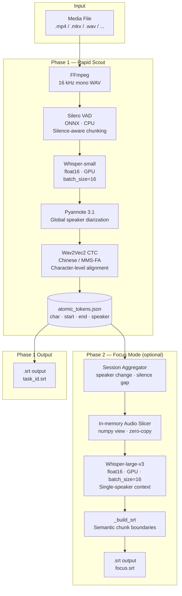

# NVTranscriber

**Local GPU-Accelerated Audio Transcription & Diarization Platform**

NVTranscriber is a self-hosted, privacy-first pipeline that converts long-form audio and video recordings into speaker-attributed, time-stamped subtitles (.srt) — entirely on your own hardware. No data leaves the machine. Every model runs locally on your GPU.

The project's architectural centrepiece is a **Two-Pass Refinement System** that combines the broad coverage of a fast scout pass with the semantic precision of a deep re-transcription pass, solving three long-standing problems in automated transcription: speaker bleeding, semantic fragmentation at silence boundaries, and dropout of code-switched words (e.g. English terms inside Mandarin speech).

---

## Table of Contents

1. [Architecture Overview](#architecture-overview)
2. [Phase 1 — Rapid Scout](#phase-1--rapid-scout)
3. [Phase 2 — Focus Mode (Pass 2 Refinement)](#phase-2--focus-mode-pass-2-refinement)
4. [Technical Highlights](#technical-highlights)
5. [Tech Stack](#tech-stack)
6. [Getting Started](#getting-started)
7. [API Reference](#api-reference)
8. [Project Structure](#project-structure)

---

## Architecture Overview



The two passes share the same converted WAV and atomic token store. Phase 2 is triggered on-demand via a separate API endpoint and writes a distinct `*_focus.srt` file, leaving the Phase 1 output intact.

---

## Phase 1 — Rapid Scout

Phase 1 processes the entire recording end-to-end and produces a usable subtitle file in a single pipeline run.

### 1.1 · FFmpeg Conversion (`converter.py`)

Every input format (`.mp4`, `.mkv`, `.avi`, `.mp3`, `.m4a`, `.flac`, `.wav`) is normalised to a **16 kHz mono PCM WAV** using a single FFmpeg subprocess:

```
ffmpeg -i {input} -vn -acodec pcm_s16le -ar 16000 -ac 1 {output}.wav
```

This canonical format is the only audio representation consumed by all downstream models.

### 1.2 · VAD Chunking (`chunker.py`)

**Silero VAD v5** (ONNX, CPU) segments the waveform into speech regions. The v5 model requires a 64-sample context window prepended to each 512-sample inference frame — without this, the LSTM state receives discontinuous input and outputs near-zero speech probabilities for every frame.

The chunker aggregates raw speech segments into **300–600 second chunks** using silence gaps as the only valid cut points, guaranteeing that no chunk boundary falls inside an active speech segment. Chunk boundaries and offsets are persisted to SQLite (`audio_chunks` table), enabling resume-from-break for long files.

### 1.3 · ASR — Whisper-small (`asr_engine.py`)

Each VAD chunk is transcribed by **`openai/whisper-small`** loaded in `float16` via the HuggingFace Transformers pipeline. The pipeline processes each chunk in 30-second overlapping sub-windows with `batch_size=16`, allowing 16 sub-windows to be inference'd in parallel on the GPU rather than serially.

Phase 1 intentionally uses the smaller model: its role is broad coverage and rough timestamp generation, not maximum accuracy. Accuracy is recovered by Phase 2's targeted re-transcription.

### 1.4 · Global Diarization — Pyannote 3.1 (`diarization_engine.py`)

**`pyannote/speaker-diarization-3.1`** runs on the **entire** converted WAV in a single call. Running diarization globally — rather than per-chunk — is critical: it allows pyannote to build a unified speaker embedding space, guaranteeing that `SPEAKER_00` in minute 1 refers to the same physical person as `SPEAKER_00` in minute 50.

The pipeline requires a HuggingFace token (`HF_TOKEN` in `backend/.env`) and acceptance of both the `pyannote/speaker-diarization-3.1` and `pyannote/segmentation-3.0` model licences on huggingface.co.

### 1.5 · CTC Forced Alignment (`forced_aligner.py`)

With Whisper's rough text and Pyannote's speaker timeline in hand, the CTC aligner maps every character to a precise millisecond boundary.

**Language routing** selects the appropriate model:

| Language (`lang` param) | Model | Notes |
|---|---|---|
| `cmn`, `zh` | `jonatasgrosman/wav2vec2-large-xlsr-53-chinese-zh-cn` | No `uroman` dependency |
| All others | `torchaudio.pipelines.MMS_FA` (facebook/mms-300m) | 1000+ languages |

The Chinese backend uses `torchaudio.functional.forced_align` + `merge_tokens` directly on the HuggingFace model's logits, avoiding the MMS tokeniser entirely. The MMS tokeniser call is wrapped in a two-attempt fallback to handle the API change between torchaudio < 2.1 (`tokenizer([lang], [text])`) and ≥ 2.1 (`tokenizer([text], language=lang)`).

**Speaker assignment** uses a per-character midpoint lookup with an O(n + m) dual-pointer sweep. When multiple Pyannote turns overlap a character's midpoint (cross-talk), the **latest-starting** turn wins — assigning the word to the interrupter rather than the speaker with a lingering long tail.

A sliding-window **majority-vote smoother** (`window=5`) eliminates single-character speaker glitches before persisting.

### 1.6 · Atomic Token Persistence

The full character array — `[{"char": "哈", "start": 29.12, "end": 29.25, "speaker": "SPEAKER_04"}, …]` — is written to `workspace/transcripts/{task_id}_atomic_tokens.json`. This file is the authoritative intermediate representation. Every downstream step reads from it; no re-alignment is ever needed for re-rendering with different parameters.

---

## Phase 2 — Focus Mode (Pass 2 Refinement)

Phase 2 solves three defects that are structurally unavoidable in a single-pass pipeline:

| Problem | Root Cause | Focus Mode Solution |
|---|---|---|
| **Speaker bleeding** | VAD cuts mid-sentence; Whisper context spans two speakers | Re-transcribe pure single-speaker slices |
| **Semantic fragmentation** | VAD silence boundaries interrupt grammatical units | Session aggregation uses speaker identity, not silence |
| **Code-switching dropout** | CTC models lack English tokens for Chinese text | Bypass CTC; use Whisper's native multilingual output |

### 2.1 · Session Aggregation (`refiner.py · aggregate_sessions`)

The atomic token array is scanned to produce **Speaker Sessions** — contiguous blocks of same-speaker content:

```
New session when:
  token["speaker"] != current_speaker   (speaker identity changes)
  OR
  token["start"] - prev["end"] > 2.0 s  (silence gap, strictly greater-than)
```

The strictly-greater-than comparison is intentional: a gap of exactly `session_gap_s` does not split, preserving natural short pauses within a single speaker's turn.

### 2.2 · Surgical In-Memory Audio Slicing (`refiner.py · slice_audio_session`)

Each session is extracted from the full waveform as a **numpy view** (zero-copy, no disk write) with 0.2 s of safety padding on each side. Padding is clamped to the array bounds to prevent negative indices (file start) and array overruns (file end).

```python
actual_start_s = max(0.0, start_s - 0.2)
actual_end_s   = min(total_s, end_s + 0.2)
slice_view     = audio_np[int(actual_start_s * 16000) : int(actual_end_s * 16000)]
```

The slice index boundaries are stored rather than the slice arrays themselves, so no extra memory is consumed between the ASR pass and any subsequent processing.

### 2.3 · Deep Semantic Transcription

Each session slice is re-transcribed by **`openai/whisper-large-v3`** (`float16`, `batch_size=16`). Because the slice is guaranteed to contain a single speaker's continuous thought, Whisper's 30-second attention window spans only that speaker's speech, eliminating cross-speaker context contamination.

Whisper's native chunk boundaries (returned with `return_timestamps=True`) become the subtitle break points directly. No secondary segmentation is applied.

### 2.4 · Global Timestamp Re-mapping

Whisper reports timestamps relative to the slice start. Each chunk is offset by `actual_start_s` to recover the global file timeline:

```python
global_start = chunk["timestamp"][0] + actual_start_s
global_end   = chunk["timestamp"][1] + actual_start_s   # None → padded slice end
```

The speaker label from the session is attached to every subtitle block — no model inference is required for speaker attribution in Phase 2.

### 2.5 · SRT Output

The block list is passed directly to `_build_srt`, producing:

```
1
00:29:07,200 --> 00:29:09,800
[SPEAKER_04]: 哈喽大家好我是第二次参与辩论的音乐创作人刘恋

2
00:29:10,100 --> 00:29:12,500
[SPEAKER_01]: and I think the most important thing is the melody
```

English code-switched words survive intact because Whisper — not a Chinese-only CTC model — produces the transcript.

---

## Technical Highlights

### VRAM Management

The pipeline is designed for an **8 GB RTX 3070** (models declared for 16 GB headroom; actual peak is lower due to sequential loading):

| Stage | Model | Approx. VRAM | Load strategy |
|---|---|---|---|
| Phase 1 ASR | whisper-small (fp16) | ~0.5 GB | Load → run all chunks → `del` + `empty_cache()` |
| Diarization | pyannote 3.1 | ~1.7 GB | Load → run full file → `del` + `empty_cache()` |
| CTC Alignment | wav2vec2-chinese | ~1.4 GB | Load → run all sessions → `unload_fa_model()` |
| Phase 2 ASR | whisper-large-v3 (fp16) | ~3.1 GB | Load → run all sessions → `del` + `empty_cache()` |

Models are never simultaneously resident. The `vram_manager.py` module checks free VRAM before each model load (`torch.cuda.mem_get_info()`), logs a warning, and falls back to CPU if the 4 GB safety threshold is not met.

### Windows Compatibility

Two Windows-specific stability patches are applied at runtime:

**1. PyTorch CVE-2025-32434 bypass**

On PyTorch < 2.6.0, `torch.load` on `.bin` weight files raises a `ValueError` due to a security block. Both the Chinese Wav2Vec2 model and the Whisper models are loaded with `use_safetensors=True`, which routes the loader to the `.safetensors` format and bypasses the restriction entirely.

**2. SpeechBrain lazy-import stubbing**

Pyannote transitively imports SpeechBrain, which registers a `LazyModule` loader for submodules including `speechbrain.integrations.k2_fsa` (which depends on `k2`, unavailable on Windows). When PyTorch/Transformers call `inspect.getmembers()` during the CTC model's forward pass, Python's module machinery triggers SpeechBrain's lazy loader, crashing the pipeline. The fix injects a hollow stub before the CTC pass:

```python
if "speechbrain" in sys.modules and "speechbrain.integrations.k2_fsa" not in sys.modules:
    sys.modules["speechbrain.integrations.k2_fsa"] = types.ModuleType("speechbrain.integrations.k2_fsa")
```

Additionally, all `speechbrain.*` entries are temporarily removed from `sys.modules` during `run_forced_alignment` and restored in a `finally` block, preventing any lazy-import chain from being triggered during the CTC forward pass.

### Batch Processing Performance

The HuggingFace `pipeline` is instantiated with `batch_size=16`. Long audio is split into 30-second sub-windows internally; with batching enabled, 16 windows are processed in a single GPU kernel dispatch rather than 16 sequential dispatches. On an RTX 3070, this reduces the per-window overhead from ~200 ms to ~40 ms for whisper-small.

### Silero VAD v5 API Correction

Silero VAD v5 changed its ONNX model interface relative to v4:

| | v4 | v5 |
|---|---|---|
| State inputs | `h [2,1,64]`, `c [2,1,64]` | `state [2,1,128]` |
| Context window | None | 64 samples prepended to each 512-sample frame |

Both changes are implemented in `chunker.py`. Without the context window, the model outputs near-zero speech probability for every frame regardless of audio content.

---

## Tech Stack

| Layer | Technology |
|---|---|
| **API** | FastAPI · Uvicorn · Pydantic v2 |
| **Database** | SQLite · SQLAlchemy 2 (async) · aiosqlite |
| **ASR** | HuggingFace Transformers · `openai/whisper-small` (Phase 1) · `openai/whisper-large-v3` (Phase 2) |
| **Diarization** | `pyannote/speaker-diarization-3.1` |
| **VAD** | Silero VAD v5 (ONNX · CPU via onnxruntime) |
| **CTC Alignment** | `jonatasgrosman/wav2vec2-large-xlsr-53-chinese-zh-cn` · `torchaudio.pipelines.MMS_FA` |
| **Deep Learning** | PyTorch · torchaudio · accelerate · bitsandbytes |
| **Audio I/O** | soundfile · FFmpeg (subprocess) |
| **Environment** | python-dotenv · pynvml |

---

## Getting Started

### Prerequisites

- Python 3.11+
- CUDA toolkit (tested with CUDA 12.4 on RTX 3070)
- FFmpeg in PATH (Windows: install the **full-shared** build for torchcodec DLL compatibility)
- HuggingFace account with access granted to:
  - `pyannote/speaker-diarization-3.1`
  - `pyannote/segmentation-3.0`

### Installation

```powershell
# 1. Create virtual environment
python -m venv venv
.\venv\Scripts\Activate.ps1

# 2. Install PyTorch with CUDA 12.4 wheels
pip install torch torchaudio --index-url https://download.pytorch.org/whl/cu124

# 3. Install remaining dependencies
pip install -r backend\requirements.txt

# 4. Configure secrets
copy backend\.env.example backend\.env
# Edit backend\.env and set HF_TOKEN=hf_...
```

Or use the bundled setup script:

```powershell
.\setup.ps1 -CudaVersion cu124
```

### Running the Server

```powershell
uvicorn backend.main:app --reload --host 127.0.0.1 --port 8000
```

On startup the server logs:
```
CUDA available: NVIDIA GeForce RTX 3070
```
or a CPU fallback warning if CUDA is unavailable.

---

## API Reference

### Full pipeline flow

```
POST /api/tasks/sync          →  scan directory, register tasks
POST /api/tasks/{id}/process  →  Phase 1: FFmpeg → VAD → ASR → Diarize → Align → SRT
POST /api/tasks/{id}/focus    →  Phase 2: Focus Mode re-transcription → *_focus.srt
GET  /api/tasks               →  list all tasks and their current status
```

### Status lifecycle

```
PENDING → CONVERTING → CHUNKING → ASR_INFERENCE → DIARIZING → ALIGNING → COMPLETED
                                                                             ↓
                                                              (focus endpoint)
                                                         Focus Mode runs in background
                                                         workspace/outputs/{id}_focus.srt
```

### `POST /api/tasks/sync`

```json
{ "directory": "D:/Recordings" }
```

Recursively scans the directory for `.mp4 .mkv .avi .mp3 .wav .m4a .flac` and registers each as a `PENDING` task.

### `POST /api/tasks/{task_id}/process`

No body required. Triggers the full Phase 1 pipeline as a background task. The endpoint returns immediately with `{"status": "processing_started"}`.

Allowed from states: `PENDING`, `FAILED`, `READY_FOR_INFERENCE`.

### `POST /api/tasks/{task_id}/focus`

No body required. Triggers Phase 2 Focus Mode. Requires the task to be in `COMPLETED` state and `atomic_tokens.json` to exist (produced by a successful Phase 1 run).

Returns:
```json
{
  "task_id": "...",
  "status": "focus_mode_started",
  "focus_srt_path": "D:/...workspace/outputs/{id}_focus.srt"
}
```

### `GET /api/tasks`

```json
[
  {
    "id": "02be6643-...",
    "original_path": "D:/Recordings/interview.mp4",
    "converted_wav_path": "...workspace/converted/02be6643-....wav",
    "output_srt_path": "...workspace/outputs/02be6643-....srt",
    "status": "COMPLETED",
    "created_at": "2026-05-06T13:03:33.714000+00:00"
  }
]
```

---

## Project Structure

```
NVTranscriber/
├── backend/
│   ├── main.py                    # FastAPI app, lifespan, all routes
│   ├── requirements.txt
│   ├── .env.example               # HF_TOKEN template
│   ├── core/
│   │   ├── converter.py           # FFmpeg wrapper + directory scanner
│   │   ├── chunker.py             # Silero VAD v5 + chunk persistence
│   │   ├── asr_engine.py          # Whisper pipeline (Phase 1 scout)
│   │   ├── diarization_engine.py  # Pyannote 3.1 global diarization
│   │   ├── forced_aligner.py      # CTC alignment, language routing, atomic tokens
│   │   ├── aligner.py             # IoU speaker assignment + SRT renderer
│   │   ├── vram_manager.py        # VRAM checks, cache clearing
│   │   └── refiner.py             # Phase 2 Focus Mode pipeline
│   ├── database/
│   │   ├── models.py              # MediaTask, AudioChunk ORM models
│   │   └── session.py             # Async SQLite engine
│   └── tests/
│       ├── test_api.py
│       ├── test_chunker.py
│       ├── test_forced_alignment.py
│       ├── test_phase2.py
│       └── test_refiner.py
├── workspace/
│   ├── converted/                 # 16 kHz WAV files
│   ├── transcripts/               # ASR JSON, diarization JSON, atomic_tokens.json
│   └── outputs/                   # Final .srt and _focus.srt files
├── frontend/                      # (Phase 3 — Next.js, not yet implemented)
├── setup.ps1                      # One-shot environment bootstrap
└── README.md
```

---

## Intermediate Files

| File | Location | Description |
|---|---|---|
| `{id}.wav` | `workspace/converted/` | 16 kHz mono PCM, source for all models |
| `{id}_asr.json` | `workspace/transcripts/` | Whisper-small segments with rough timestamps |
| `{id}_diarization.json` | `workspace/transcripts/` | Pyannote speaker turns |
| `{id}_atomic_tokens.json` | `workspace/transcripts/` | Character-level, speaker-tagged, time-stamped token array |
| `{id}.srt` | `workspace/outputs/` | Phase 1 subtitle output |
| `{id}_focus.srt` | `workspace/outputs/` | Phase 2 Focus Mode subtitle output |

The `atomic_tokens.json` file is the lossless intermediate representation. Changing rendering parameters (max characters per line, silence gap threshold) requires only re-running the lightweight `render_subtitles` function — no model inference is repeated.

---

## Running Tests

```powershell
pytest backend/tests/ -v
```

All 20 tests run entirely on CPU in under 10 seconds. GPU models are mocked via `unittest.mock.patch`; no HuggingFace weights are downloaded during the test suite.
